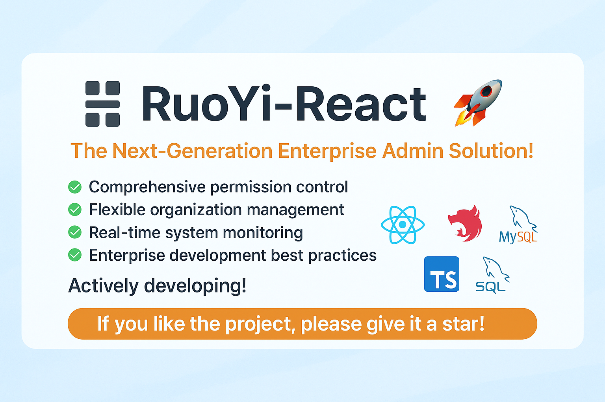

# RuoYi-React 权限管理系统



## 国内成熟的方案对比

### 1. Umi

**优点**  
✔️ 开箱即用，企业级功能完善  
**缺点**  
✖️ 黑盒化严重，定制困难

### 2. Ant Design Pro

**优点**  
✔️ 快速搭建中后台系统  
**缺点**  
✖️ 过度封装，新手难理解底层

### 3. Dva

**优点**  
✔️ 简化Redux，减少样板代码  
**缺点**  
✖️ 学习曲线陡，依赖Redux生态

## 项目初衷

随着React生态的不断发展，虽然市场上有很多优秀的后台管理系统框架，但缺少一个像若依(RuoYi)这样开箱即用、功能完备的React脚手架。现有的大多数React后台模板要么功能过于简单，要么过度复杂难以定制。

RuoYi-React项目的初衷就是打造一个**属于React生态的若依**，提供企业级中后台项目开发所需的核心功能和最佳实践，让开发者能够专注于业务逻辑的开发，而不必过多关注基础设施的搭建。我们希望通过这个项目，为React开发者提供一个功能完备、易于扩展的后台管理系统脚手架。

## 开发进度

🔥 项目主体框架已构建完成，功能持续丰富中！我们正在 积极开发中，欢迎关注、使用、提出建议！

🌟 如果你觉得这个项目不错，请不要吝啬你的 Star！
你的支持是我们持续前进的动力！

👉 点击右上角 Star 支持我们！

## 项目介绍

🚀 RuoYi-React：下一代企业级中后台解决方案！

基于经典的 RuoYi-Vue 思想，RuoYi-React 全面升级为前后端分离架构，采用 React 18 + NestJS 最新技术栈打造，融合现代前端体验与强大后端能力，助力中后台系统高效开发。

- 前端：React18、React Router v6、Redux Toolkit、Ant Design
- 后端：NestJS、TypeORM、MySQL、TypeScript
- 权限：基于RBAC（Role-Based Access Control）模型，支持菜单权限、按钮权限、数据权限

- 特色：代码简洁、架构清晰、组件封装、开箱即用

## 开发状态 & 开源邀请

> **⚠️ 项目正在积极开发中!**
>
> 作为一名React初级开发者，我希望通过这个项目为React社区贡献力量，同时也期待得到社区的帮助与支持。目前项目处于起步阶段，很多功能尚在构建中。
>
> **🔥 诚邀各位开发者加入开源贡献:**
>
> - 无论您是前端还是后端开发者，都可以参与进来
> - 欢迎提交Issue、PR或讨论新功能
> - 如发现问题或有建议，请[提交Issue](https://github.com/zhouzhishou/ice-frog/issues)
> - 对代码有任何改进想法都非常欢迎！
>
> 让我们一起打造React生态中的"若依"，为社区构建一个真正实用的企业级后台管理系统框架！

## 未来内置功能

1. 用户管理：用户是系统操作者，该功能主要完成系统用户配置
2. 部门管理：配置系统组织机构（公司、部门、小组），树结构展现支持数据权限
3. 岗位管理：配置系统用户所属担任职务
4. 菜单管理：配置系统菜单、操作权限、按钮权限标识等
5. 角色管理：角色菜单权限分配、设置角色按机构进行数据范围权限划分
6. 字典管理：对系统中经常使用的一些较为固定的数据进行维护
7. 参数管理：对系统动态配置常用参数
8. 通知公告：系统通知公告信息发布维护
9. 操作日志：系统正常操作日志记录和查询
10. 登录日志：系统登录日志记录和查询
11. 在线用户：当前系统中活跃用户状态监控
12. 定时任务：在线(添加、修改、删除)任务调度包含执行结果日志
13. 代码生成：前后端代码的生成（React、NestJS）
14. 系统接口：根据业务代码自动生成相关的API接口文档
15. 服务监控：监视当前系统CPU、内存、磁盘、堆栈等相关信息
16. 缓存监控：对系统的缓存信息查询，命令统计等

## 在线体验

- 演示地址：<https://www.ice-frog.com> (正在搭建中)
- 文档地址：<https://www.ice-frog.com> (正在搭建中)

## 技术选型

### 前端技术

| 技术          | 说明           | 官网                                                               |
| ------------- | -------------- | ------------------------------------------------------------------ |
| React         | 前端框架       | [https://react.dev/](https://react.dev/)                           |
| React Router  | 路由框架       | [https://reactrouter.com/](https://reactrouter.com/)               |
| Redux Toolkit | 状态管理工具   | [https://redux-toolkit.js.org/](https://redux-toolkit.js.org/)     |
| Ant Design    | UI组件库       | [https://ant.design/](https://ant.design/)                         |
| TypeScript    | JavaScript超集 | [https://www.typescriptlang.org/](https://www.typescriptlang.org/) |
| Vite          | 构建工具       | [https://vitejs.dev/](https://vitejs.dev/)                         |
| ESLint        | 代码检查工具   | [https://eslint.org/](https://eslint.org/)                         |
| Axios         | HTTP客户端     | [https://axios-http.com/](https://axios-http.com/)                 |

### 后端技术

| 技术       | 说明           | 官网                                                               |
| ---------- | -------------- | ------------------------------------------------------------------ |
| NestJS     | 后端框架       | [https://nestjs.com/](https://nestjs.com/)                         |
| TypeORM    | ORM框架        | [https://typeorm.io/](https://typeorm.io/)                         |
| MySQL      | 关系型数据库   | [https://www.mysql.com/](https://www.mysql.com/)                   |
| Redis      | 缓存数据库     | [https://redis.io/](https://redis.io/)                             |
| JWT        | 认证授权       | [https://jwt.io/](https://jwt.io/)                                 |
| Swagger    | API文档生成    | [https://swagger.io/](https://swagger.io/)                         |
| TypeScript | JavaScript超集 | [https://www.typescriptlang.org/](https://www.typescriptlang.org/) |

## 环境要求

- Node.js 16+
- MySQL 5.7+
- Redis 6.0+

## 快速开始

### 开发环境

```bash
# 克隆项目
git clone https://gitee.com/zhouzhishou/ice-frog.git

# 进入项目目录
cd RuoYi-React

# 安装依赖
pnpm install

初始化数据库
请先手动导入数据库脚本 packages/server/sql/*.sql
pnpm docker:mysql
# 启动服务
pnpm start
```

前端访问地址：<http://localhost:5173>  
后端接口地址：<http://localhost:3000/api>  
接口文档地址：<http://localhost:3000/api/docs>

### 生产环境

```bash
# 构建项目
pnpm build

# 启动服务
pnpm start
```

## 项目结构

```
ice-frog/
├── packages/                 # Monorepo工作区
│   ├── admin/                # 前端项目
│   │   ├── public/           # 静态资源
│   │   ├── src/              # 源代码
│   │   │   ├── api/          # 接口请求
│   │   │   ├── assets/       # 项目资源
│   │   │   ├── components/   # 通用组件
│   │   │   ├── layouts/      # 布局组件
│   │   │   ├── pages/        # 页面
│   │   │   ├── permission/   # 权限管理
│   │   │   ├── router/       # 路由配置
│   │   │   ├── store/        # 状态管理
│   │   │   ├── utils/        # 工具函数
│   │   │   └── App.tsx       # 应用入口
│   │   └── package.json      # 项目配置
│   └── server/               # 后端项目
│       ├── src/              # 源代码
│       │   ├── config/       # 配置文件
│       │   ├── controllers/  # 控制器
│       │   ├── dto/          # 数据传输对象
│       │   ├── entities/     # 数据库实体
│       │   ├── services/     # 服务层
│       │   ├── utils/        # 工具函数
│       │   └── main.ts       # 应用入口
│       └── package.json      # 项目配置
├── docs/                     # 项目文档
├── .env                      # 环境变量
├── package.json              # 项目配置
└── README.md                 # 项目说明
```

## 演示图

项目运行截图正在准备中...

<!--
<table>
    <tr>
        <td></td>
        <td></td>
    </tr>
    <tr>
        <td></td>
        <td></td>
    </tr>
</table>
-->

## 特别鸣谢

- [RuoYi-Vue](https://gitee.com/y_project/RuoYi-Vue) - 为本项目提供了灵感与参考
- [Ant Design](https://ant.design/) - 优秀的UI组件库
- [NestJS](https://nestjs.com/) - 构建高效、可靠和可扩展的服务器端应用程序的框架

## 版本记录

查看[版本更新记录](CHANGELOG.md)

## 贡献指南

1. Fork 本仓库
2. 新建分支 (`git checkout -b feature/your-feature`)
3. 提交更改 (`git commit -m 'Add some feature'`)
4. 推送到分支 (`git push origin feature/your-feature`)
5. 提交 Pull Request

## 许可证

[MIT License](LICENSE)

## 联系我们

- 交流社区：欢迎通过 Issues 或 Discussions 与我们交流
- 问题反馈：

- <https://github.com/zhouzhishou123/RuoYi-React/issues>

- <https://gitee.com/zhouzhishou/RuoYi-React/issues>

## 捐赠支持

如果您觉得这个项目对您有帮助，欢迎捐赠支持我们持续开发维护


